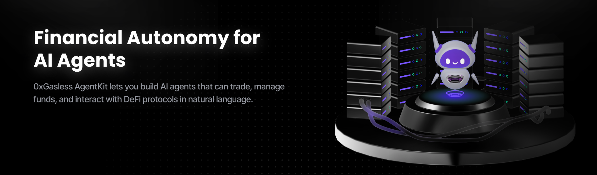

<div align="center">
  <p>
    <a href="https://docs.0xgasless.com/docs">
      
    </a>
  </p>
  <h1 style="font-size: 3em; margin-bottom: 20px;">
    0xGasless AgentKit
  </h1>

  <p style="font-size: 1.2em; max-width: 600px; margin: 0 auto 20px;">
    0xGasless AgentKit lets you build AI agents that can trade, manage funds, and interact with DeFi protocols in natural language.
  </p>

</div>

## Key Features

- **Framework-agnostic**: Common AI Agent primitives that can be used with any AI framework.
- **Python and Node.js Support**
- **Support for various onchain actions**:

  - Getting wallet details and balances
  - Transferring and trading tokens

  Coming Soon
  - Deploying [ERC-20](https://docs.openzeppelin.com/contracts/5.x/erc20) tokens
  - Deploying [ERC-721](https://docs.openzeppelin.com/contracts/5.x/erc721) tokens and minting NFTs
  - Buying and selling [Dex Swap](https://uniswap.org/) ERC-20 coins
  - Wrapping ETH to WETH on Base

  Or [add your own](./CONTRIBUTING.md#adding-an-action-to-agentkit-core)!

## Examples

Check out [agentkit-langchain/examples](./agentkit-langchain/examples) for inspiration and help getting started!
- [Chatbot Python](./agentkit-langchain/examples/chatbot-python/README.md): Simple example of a Python Chatbot that can perform complex onchain interactions, using OpenAI.
- [Chatbot Typescript](./agentkit-langchain/examples/chatbot-typescript/README.md): Simple example of a Node.js Chatbot that can perform complex onchain interactions, using OpenAI.

## Repository Structure

AgentKit is organized as a [monorepo](https://en.wikipedia.org/wiki/Monorepo) that contains multiple packages.

```
./
├── agentkit-core/
│   ├── python/
│   └── typescript/
├── agentkit-langchain/
│   ├── python/
│   ├── typescript/
│   └── examples/
```

### agentkit-core

Core primitives and framework-agnostic tools that are meant to be composable and used via AgentKit framework extensions (ie, `agentkit-langchain`).
See [AgentKit Core](./agentkit-core/README.md) to get started!

### agentkit-langchain

Langchain Toolkit extension of AgentKit. Enables agentic workflows to interact with onchain actions.
See [AgentKit Langchain](./agentkit-langchain/README.md) to get started!

## Contributing

AgentKit welcomes community contributions.
See [CONTRIBUTING.md](CONTRIBUTING.md) for more information.

## Documentation

- [AgentKit Documentation](https://docs.0xgasless.com/docs)

## Security and bug reports

The AgentKit team takes security seriously.
See [SECURITY.md](../SECURITY.md) for more information.

## License

Apache-2.0
